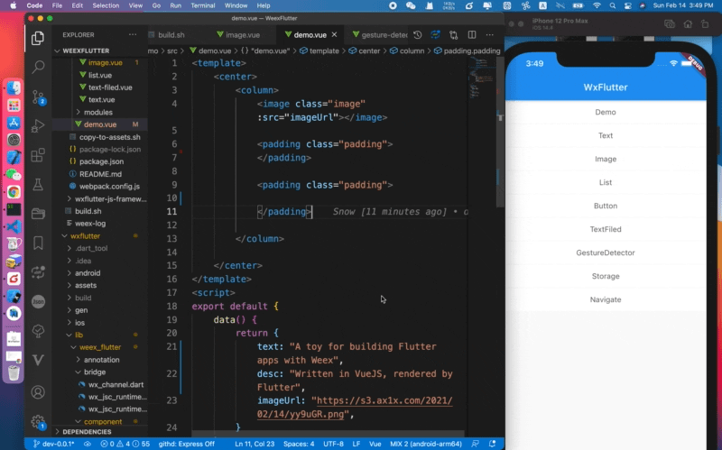

# WxFlutter
> When weex meeting Flutter!  
> Notice:This is an example project of Flutter and Weex using Vuejs.

Written in VueJS, rendered by Flutter



# What is WxFlutter
WxFlutter = Weex + Flutter  
You can run weex code inside yours Flutter Mobile Apps!


## How to build

```bash

flutter packages pub run build_runner build clean
flutter packages pub run build_runner build --delete-conflicting-outputs
flutter packages pub run build_runner build
```

### Module extend

1.Customize modules class must extend from WXModule.  
2.Extended module class must add @Module('YOUR_MODULE_NAME') and @Reflector() annotation  
3.Extended method must add @JSMethod annotation  
4.Add `export './module/YOUR_MODULE_NAME.dart';` into `wx_module_componet.dart` file  
5.Run command `flutter packages pub run build_runner build`  

### Component extend

1.Customize component class must extend from WXBaseWidget.  
2.Extended module class must add @Module('YOUR_COMPONENT_NAME') and @Reflector() annotation  
3.Extended method must add @JSMethod  
4.Add `export './component/YOUR_MODULE_NAME.dart';` into `wx_module_componet.dart` file  
5.Run command `flutter packages pub run build_runner build`  


## TODO 

- [ ] Wxflutter CLI
- [ ] More Component's method
- [ ] More Modules
- [ ] Debug toolkit
- [ ] Testing
- [ ] Documents

## Basic technology

This project is used some amazing packages:

- [Weex](https://github.com/apache/incubator-weex)
- [flutter_js](https://github.com/abner/flutter_js)
- [HybridFlutter](https://github.com/githubliruiyuan/HybridFlutter)


## License

This project is licensed under the MIT License.
